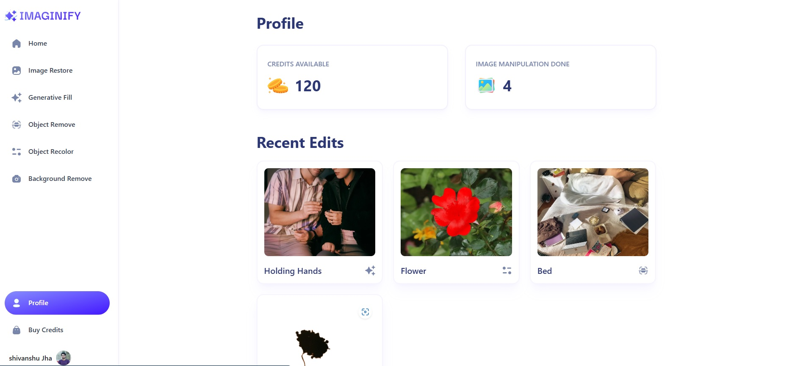
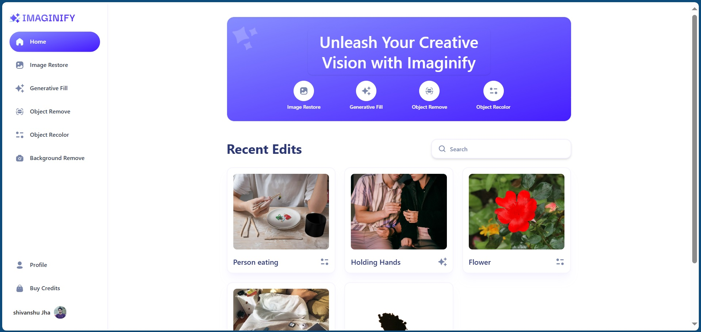
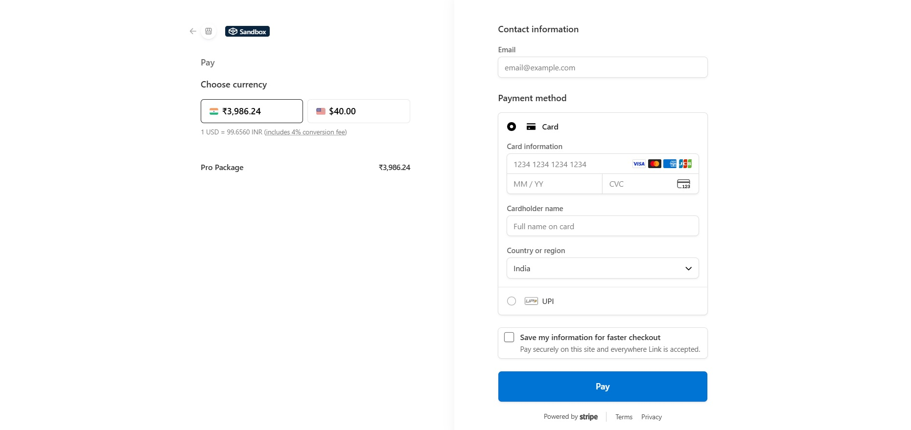

# Imaginify ✨  
An **AI-powered SaaS image editing platform** built with **Next.js 16+**, **MongoDB**, **Clerk**, **Cloudinary AI**, **Shadcn UI**, **Stripe**, **Zod**, and **TypeScript**.  

Imaginify lets users restore, recolor, remove, and transform images using cloudinary ai — with a **credit-based payment system** powered by Stripe.

Check it out here: [imaginify-opal-kappa](https://imaginify-opal-kappa.vercel.app)

---

## 🚀 Features
- **Image Restore** – bring old or damaged photos back to life  
- **Generative Fill** – extend or fill missing parts of an image  
- **Object Remove** – erase unwanted objects seamlessly  
- **Object Recolor** – change colors of specific elements  
- **Background Remove** – isolate subjects with one click  
- **Buy Credits** – Stripe-powered checkout for credit purchases  

---

## 🛠 Tech Stack
| Technology | Usage |
|------------|-------|
| Next.js 16+ | App framework with App Router |
| TypeScript | Strong typing & safety |
| MongoDB | Database for users, transactions, images |
| Clerk | Authentication & user management |
| Cloudinary AI | Image transformations |
| Shadcn UI | Modern UI components |
| Stripe | Payments & credit system |
| Zod | Schema validation |
| Tailwind v4 | Styling & responsive design |

---

## ⚙️ Installation & Setup

1. **Clone the repo**
   ```bash
   git clone https://github.com/your-username/imaginify.git
   cd imaginify

2. **Install Dependency**
    ```bash
    npm install

3. **Set Up Environment Variables**
   ```bash
    NEXT_PUBLIC_CLERK_PUBLISHABLE_KEY=your_clerk_publishable_key
    CLERK_SECRET_KEY=your_clerk_secret_key
    NEXT_PUBLIC_CLOUDINARY_CLOUD_NAME=your_cloudinary_cloud_name
   CLOUDINARY_API_KEY=your_cloudinary_api_key
    CLOUDINARY_API_SECRET=your_cloudinary_api_secret
    NEXT_PUBLIC_STRIPE_PUBLISHABLE_KEY=your_stripe_publishable_key
    STRIPE_SECRET_KEY=your_stripe_secret_key
    STRIPE_WEBHOOK_SECRET=your_stripe_webhook_secret
    MONGODB_URL=your_mongodb_connection_string
    NEXT_PUBLIC_SERVER_URL=http://localhost:3000

4. **Run the dev server**
     ```bash
     npm run dev

## 💳 Credit System
   - Users sign in via Clerk
   - Credits are purchased via Stripe Checkout
   - Each AI transformation deducts credits from the user’s balance

## 📸 Screenshots
### Dashboard with credit balance


### Image editor with AI tools


### Stripe checkout flow


